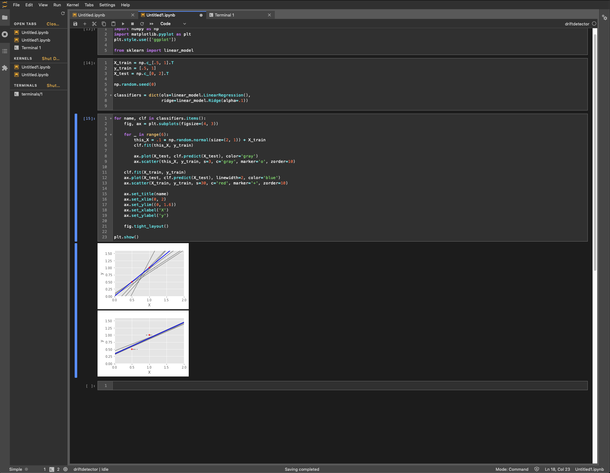

# JupyterLab Material Darker theme
[](https://github.com/ahgraber/jupyterlab-theme-material-darker/actions/workflows/build.yml)    [](https://github.com/ahgraber/jupyterlab-theme-material-darker/actions/workflows/npm-publish.yml)

Theme for jupyterlab based on [jupyterlab/theme-cookiecutter](https://github.com/jupyterlab/theme-cookiecutter), inspired by
[arbennett/jupyterlab-themes](https://github.com/arbennett/jupyterlab-themes) and [base16](https://github.com/chriskempson/base16)

## Installation
```bash
pip install jupyterlab_material_darker
```

<!--
Themes can be installed directly from `npm` using the standard JupyterLab installation method:
```
jupyter labextension install @ahgraber/{THEMENAME}
```

Themes can also be installed from source.  From a theme's subdirectory:
```
npm install
jupyter labextension link .
``` -->

## Screenshots


<!--

-->

## Requirements

* JupyterLab >= 3.0

## Development install

Note: You will need NodeJS to build the extension package.

The `jlpm` command is JupyterLab's pinned version of
[yarn](https://yarnpkg.com/) that is installed with JupyterLab. You may use
`yarn` or `npm` in lieu of `jlpm` below.

```bash
# Clone the repo to your local environment
# Change directory to the jupyterlab_material_darker directory
# Install package in development mode
pip install -e .
# Link your development version of the extension with JupyterLab
jupyter labextension develop . --overwrite
# Rebuild extension Typescript source after making changes
jlpm run build
```

You can watch the source directory and run JupyterLab at the same time in different terminals to watch for changes in the extension's source and automatically rebuild the extension.

```bash
# Watch the source directory in one terminal, automatically rebuilding when needed
jlpm run watch
```

_Run JupyterLab in another terminal_
```bash
jupyter lab
```

With the watch command running, every saved change will immediately be built locally and available in your running JupyterLab. Refresh JupyterLab to load the change in your browser (you may need to wait several seconds for the extension to be rebuilt).

By default, the `jlpm run build` command generates the source maps for this extension to make it easier to debug using the browser dev tools. To also generate source maps for the JupyterLab core extensions, you can run the following command:

```bash
jupyter lab build --minimize=False
```

### Uninstall

```bash
pip uninstall jupyterlab_material_darker
jupyter labextension uninstall @ahgraber/jupyterlab_material_darker
# may have to delete file manually
rm -rf /path/to/envs/ENVNAME/share/jupyter/labextensions/@ahgraber/jupyterlab_material_darker
```
