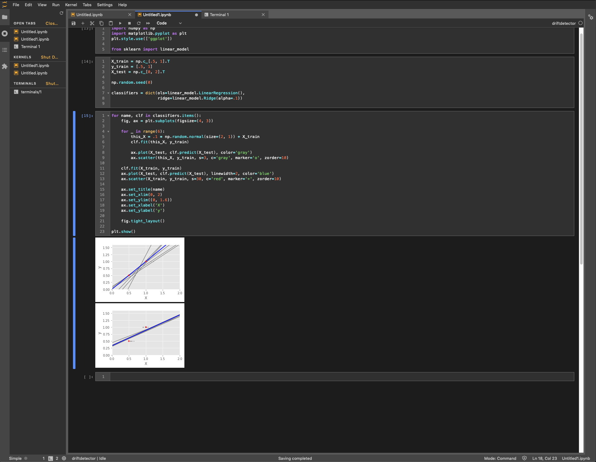

# JupyterLab Material Night Eighties theme

[](https://github.com/ninerealmlabs/jupyterlab-theme-material-night-eighties/actions/workflows/build.yaml)[](https://github.com/ninerealmlabs/jupyterlab-theme-material-night-eighties/actions/workflows/check-release.yaml)[](https://github.com/ninerealmlabs/jupyterlab-theme-material-night-eighties/actions/workflows/publish-release.yaml)

Theme for jupyterlab based on [jupyterlab/extension-template](https://github.com/jupyterlab/extension-template),
inspired by [oriolmirosa/jupyterlab_materialdarker](https://github.com/oriolmirosa/jupyterlab_materialdarker),
[arbennett/jupyterlab-themes](https://github.com/arbennett/jupyterlab-themes), [VSCode Material Theme Kit](https://marketplace.visualstudio.com/items?itemName=ms-vscode.Theme-MaterialKit),
and [base16](https://github.com/chriskempson/base16)

- [JupyterLab Material Night Eighties theme](#jupyterlab-material-night-eighties-theme)
  - [Requirements](#requirements)
  - [Installation](#installation)
  - [Screenshots](#screenshots)
  - [Contributing](#contributing)
    - [Development install](#development-install)
    - [Updating dependencies](#updating-dependencies)
    - [Development uninstall](#development-uninstall)
    - [Testing the extension](#testing-the-extension)
    - [Packaging the extension](#packaging-the-extension)

See [CONTRIBUTING.md](./CONTRIBUTING.md) for the test runbook, pinned-dependency rationale, and
guidance on editing the color palette.

## Requirements

- JupyterLab >= 4.0

Because Notebook 7 is built on JupyterLab 4 components, this theme also works in Notebook 7
with no additional configuration.

> For JupyterLab 3, use version `0.3.3` or earlier.

## Installation

To install the extension, execute:

```sh
pip install jupyterlab-material-night-eighties
```

or, with [uv](https://docs.astral.sh/uv/):

```sh
uv pip install jupyterlab-material-night-eighties
```

## Screenshots



<!--

-->

## Contributing

### Development install

Development requires Node.js 24 and [uv](https://docs.astral.sh/uv/).
Node.js 24 matches CI.

This project uses uv to manage the Python environment.
`hatchling` remains the build backend — `hatch-jupyter-builder` is a hatchling build hook, and it
is what compiles the TypeScript and stages the prebuilt labextension into `share/jupyter`.

The `jlpm` command is JupyterLab's pinned version of [yarn](https://yarnpkg.com/) that is installed with JupyterLab.

```bash
git clone https://github.com/ninerealmlabs/jupyterlab-theme-material-night-eighties.git
cd jupyterlab-theme-material-night-eighties

# Create the dev environment (JupyterLab, jupyter-builder, hatch)
uv sync

# Install the extension in editable mode
uv pip install -e .

# Link your development version of the extension with JupyterLab
uv run jupyter-builder develop . --overwrite

# Rebuild extension TypeScript source after making changes
uv run jlpm build
```

You can watch the source directory and run JupyterLab at the same time in different terminals
to watch for changes in the extension's source and automatically rebuild the extension.

- Terminal A:

  ```bash
  # Watch the source directory in one terminal, automatically rebuilding when needed
  uv run jlpm run watch
  ```

- Terminal B:

  ```sh
  uv run jupyter lab
  ```

With the watch command running, every saved change will immediately be built locally and available in your running JupyterLab.
Refresh JupyterLab to load the change in your browser (you may need to wait several seconds for the extension to be rebuilt).

By default, the `jlpm build` command generates the source maps for this extension to make it easier to debug using the browser dev tools.
To also generate source maps for the JupyterLab core extensions, you can run the following command:

```bash
jupyter lab build --minimize=False
```

### Updating dependencies

Some dependencies are deliberately pinned below their latest release, and this repo intentionally diverges from the upstream JupyterLab template in a few places.
See [CONTRIBUTING.md](./CONTRIBUTING.md#pinned-dependencies) before bumping anything.

### Development uninstall

```bash
uv pip uninstall jupyterlab-material-night-eighties
```

In development mode, you will also need to remove the symlink created by `jupyter-builder develop` command.
Run `uv run jupyter labextension list` to find the active `labextensions` directory.
Within it, remove the symlink at `@ninerealmlabs/jupyterlab_material_night_eighties`.

### Testing the extension

Use the [test runbook](./CONTRIBUTING.md#test-runbook) for local validation.
It covers the core CI gates, integration tests, packaging checks, and the manual visual review used before a release.

### Packaging the extension

See [RELEASE](RELEASE.md)
